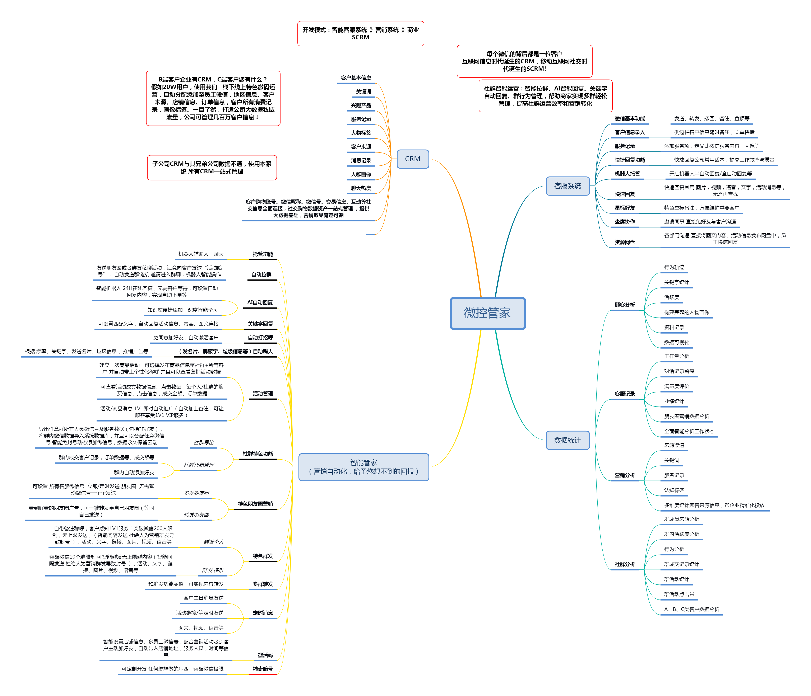

# 介绍

## 微控API 是什么?   

[微控API](api-wen-dang/) 是一套商业的的微信**个人号** 接口，它能监测微信中的各种事件，并辅助微信执行各种操作，提供了客户与微信个人号对接的能力，技术上来讲是一款基于**MAC/IPAD**协议开放性API。杜绝封号，追封，批量封等封号问题，支持多种微信方式接入。

你可以 **通过API** 实现 **个性化微信功能** （例：营销系统、机器人小助手、客服系统等），用来自动管理微信消息。

**可开发的功能包括但不限于：**

* **好友管理：**添加好友、删除好友、修改备注、创建标签、获取好友列表、检测僵尸粉
* **消息管理：**发文本消息、图片消息、名片消息、动图表情、小程序、发文件、发送视频、发送URL链接
* **群管理：**自动创群、修改群名称、邀请新成员、踢群成员、获取群列表、发送邀请链接、获取群聊。
* **朋友圈：**发送朋友圈、朋友圈点赞、获取朋友圈列表、转发朋友圈、同步朋友圈，批量发送朋友圈
* **基于API您可以创造更多有趣的功能.....**

## 我们的优势？ 

我们是一家专业提供[个人号API](https://weixin.qq.com/)的技术团队，服务于具有[SCRM](https://www.douban.com/note/555655066/)、[机器人](https://app.gitbook.com/@wkteam/s/api/~/edit/drafts/-Llzb6UGMbBY7tEgJjoy/)、[营销系统](www.baidu.com)等具有研发能力的公司,同时我们也接收因使用[Xposed](https://sspai.com/post/45473)、[ipad协议](https://app.gitbook.com/@wkteam/s/api/~/edit/drafts/-Lm3Fy_qCkIq7pig0jkb/)、[PC Hook](https://app.gitbook.com/@wkteam/s/api/~/edit/drafts/-Lm3Fy_qCkIq7pig0jkb/)导致被微信批量封号的厂商，我们合作伙伴目前包含：金融服务行业Top10、知名Xposed群控厂商、提供SCRM的定制型公司、知名协议付费平台等。

同时我们目前提供的API可开展的业务包括并且不限于：

##    为什么市场上都在用协议技术?

* **Web网页端：**2017年后不再支持新号登录，仅支持老号，并且掉线严重，功能缺失严重。
* **Xposed技术：**在2019年6月份，微信官方在行业重点打击Xposed，自此行业内一片哀嚎遍野，陆续向iPad/MAC协议转型。[具体案例请点击](https://mp.weixin.qq.com/s/0sha13ki-iTWi-SJu1EVIw)
* **PC Hook：**代码注入型破解，封号情况偏多，使用容易出现追封，公司大规模封号等情况，且目前在营销行业使用率较少，比较偏小团队使用
* **模拟机：**延迟高、消息实时到达率低、模拟人为操作效率慢、功能偏少，承担不了商业化功能
* **Ipad协议**：安全性较好，功能满足，行业占有率高，但具有能力研发人员偏少，基本两三个团队研发，且目前已有团队解散，部分微信号段登录失败、且通过grpc,mmtls破解研发，被检测几率存在
* **MAC协议：**安全性相比iPad协议更好，功能性相比ipad协议少些，行业内具有研发能力更少，安全性、稳定性比较优秀，不会出现追封、批量封的情况

| 技术种类 | 稳定性 | 安全性 | 功能性 | 综合评分 |
| :---: | :---: | :---: | :---: | :---: |
| Web网页端 | ☆ | ☆ | ☆☆ | ☆☆ |
| Xposed技术 | ☆☆ | ☆☆ | ☆☆☆☆ | ☆☆ |
| PC HooK | ☆☆☆ | ☆☆☆ | ☆☆☆ | ☆☆☆ |
| 模拟机 | ☆☆☆ | ☆☆☆ | ☆ | ☆☆ |
| iPad协议 | ☆☆☆☆ | ☆☆☆☆ | ☆☆☆ | ☆☆☆☆ |
| MAC协议 | ☆☆☆☆ | ☆☆☆☆ | ☆☆☆ | ☆☆☆☆ |

**据2018-2019年微信第三方服务行业数据，我们可得出以下结论：**

* **稳定性：**Web网页端 &lt; Xpsoed技术 &lt; PC Hook =  模拟机 &lt; iPad协议 &lt; MAC协议 
* **功能性：**模拟机 &lt; Web网页端 &lt;  PC Hook &lt;  MAC协议 &lt; iPad协议 &lt;   Xpsoed技术  
* **安全性：**Web网页端 &lt;  Xpsoed技术 &lt; PC Hook =  模拟机 &lt;  iPad协议 &lt;  MAC协议 

## 加入我们   


#### 如果您是公司研发人员，请扫描下方二维码，我们将与您详细沟通。



#### 如果您是产品or市场调研人员，建议您将本文档熟读，我们将给予您最快的了解市场方式


